# 代码提交规范
除去常规的OA日常管理工作任务外，开发人员相关的日常开发任务和进度应通过GitLab的Issue进行缺陷跟踪管理

## IDE配置
- 现阶段提供基于```IntelliJ IDEA```的相关配置
1. 配置代码服务器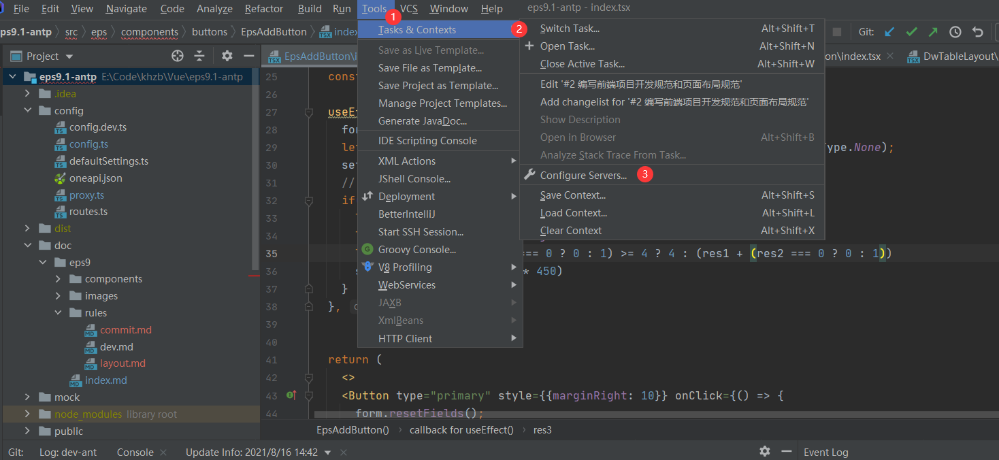
2. 点击```Configure Servers```，选择```GitLab```进行配置
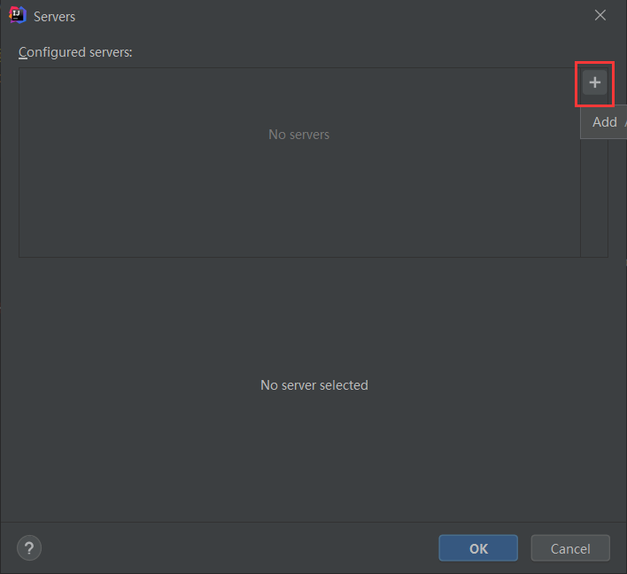
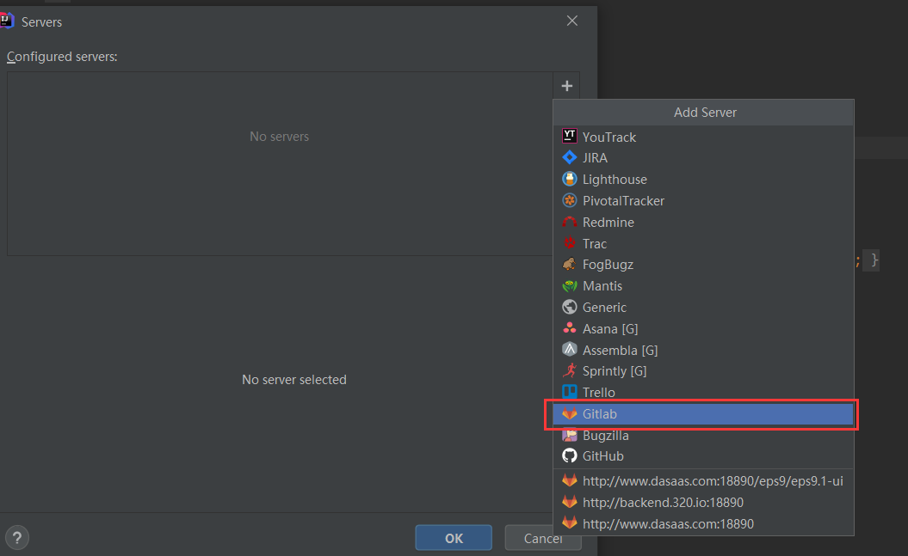
3. 填写Server URL 和token，
 - Server URL: ```http://www.dasaas.com:18890/```
 - token : [GitLab上配置的访问令牌](./token.md)
 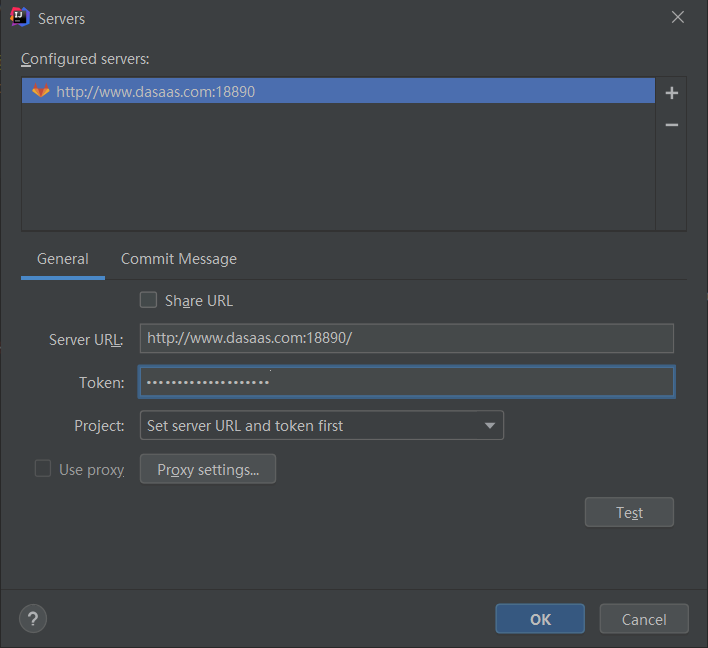
4. 配置完毕

## 任务创建
1. 登录[GitLab](http://www.dasaas.com:18890/)服务器,选择需要关联任务的项目
 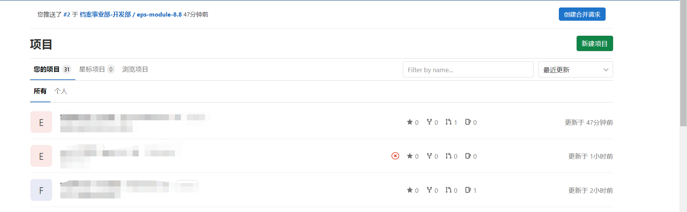
2. 点击左侧菜单```议题-列表```
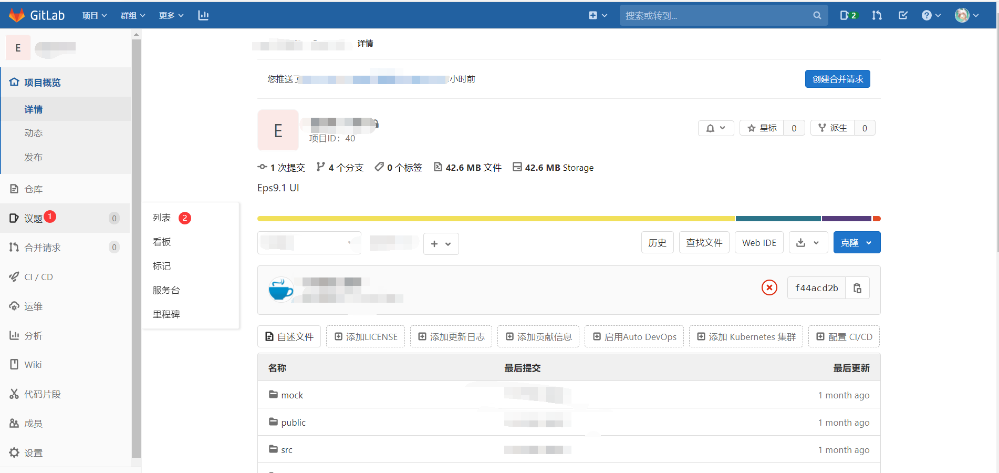
3. 点击新建```议题```
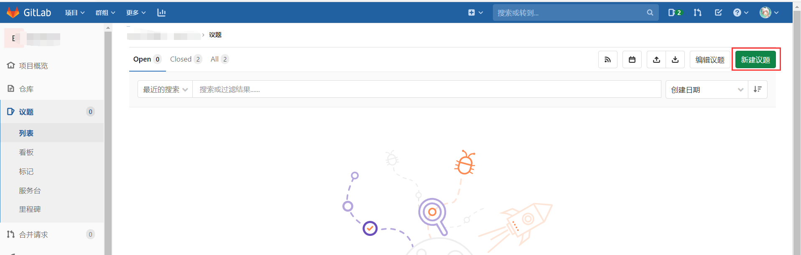
4. 填写```标题```、```任务分配人```,```截至时间```可根据实际情况进行设定
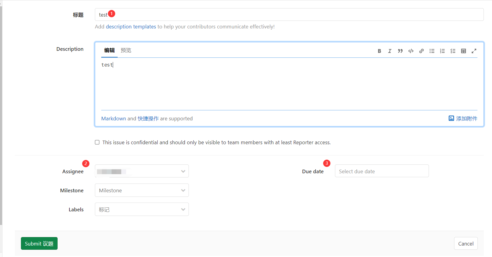
5. 填写完成后提交，可看到任务详情，可在当前页面补充附件或关闭改任务
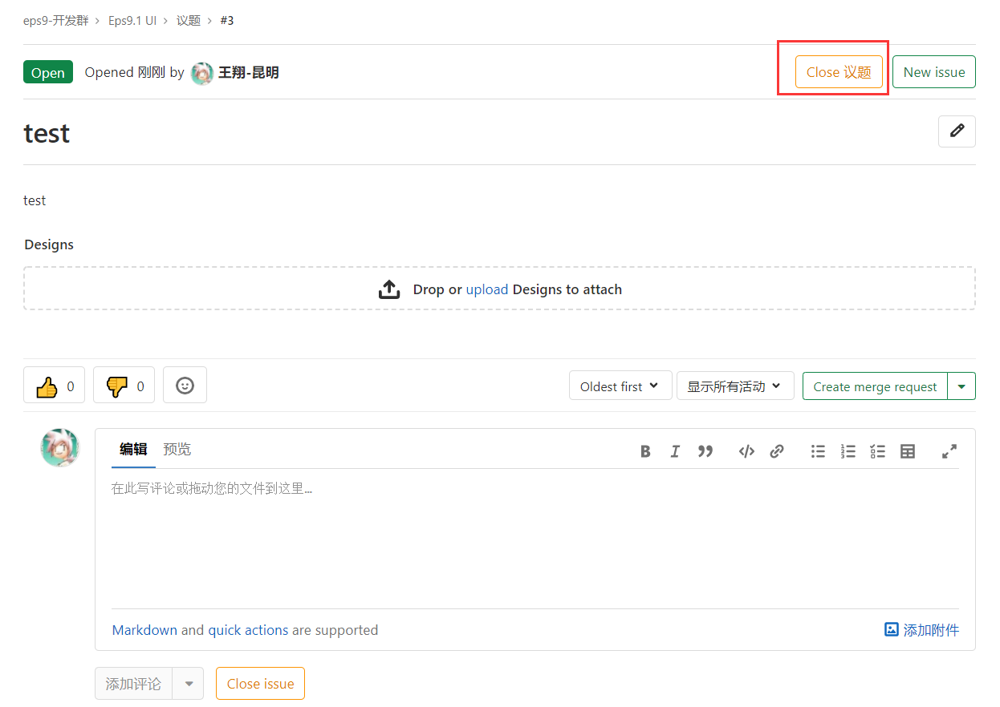


## 任务接收
1. 打开配置过步骤1的```IntelliJ IDEA```，点击右上角 任务管理器
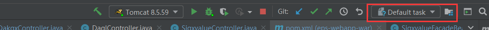
2. 点击```Open Task```,打开任务列表,即可看到分配给自己的任务
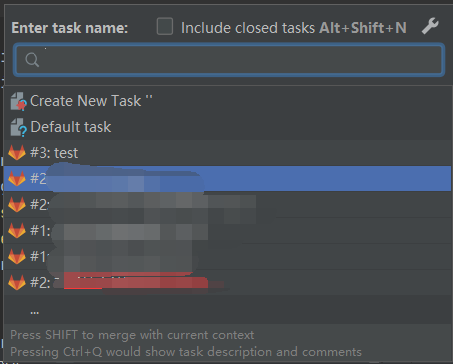

## 代码提交
1. 相关代码编写完成后，在提交代码到远程仓库时，在备注框中先加入 ```#num``` ,其中num为对应的任务编号, 中间加空格后加入该次提交说明信息,```commit```完成后， ```push```到gitlab
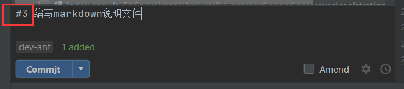

## 任务关闭
1. 登录[GitLab](http://www.dasaas.com:18890/)服务器,选择需要关联任务的项目
 
2. 点击左侧菜单```议题-列表```

3. 点击某条任务即可查看详情
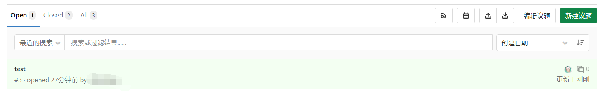
4. 在详情页点击```关闭议题```即可


## 任务查看
1. 登录[GitLab](http://www.dasaas.com:18890/)服务器,选择需要关联任务的项目
 
2. 点击左侧菜单```议题-列表```

3. 点击某条任务即可查看详情

4. 在详情页，可以看到在该任务下，提交过的代码信息
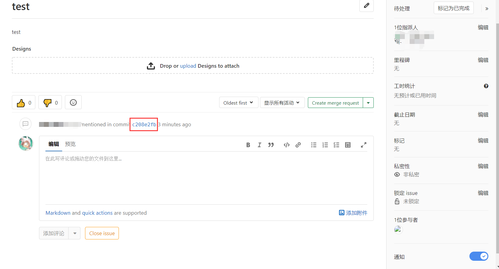
5. 点击版本编号，可查看提交的代码详情
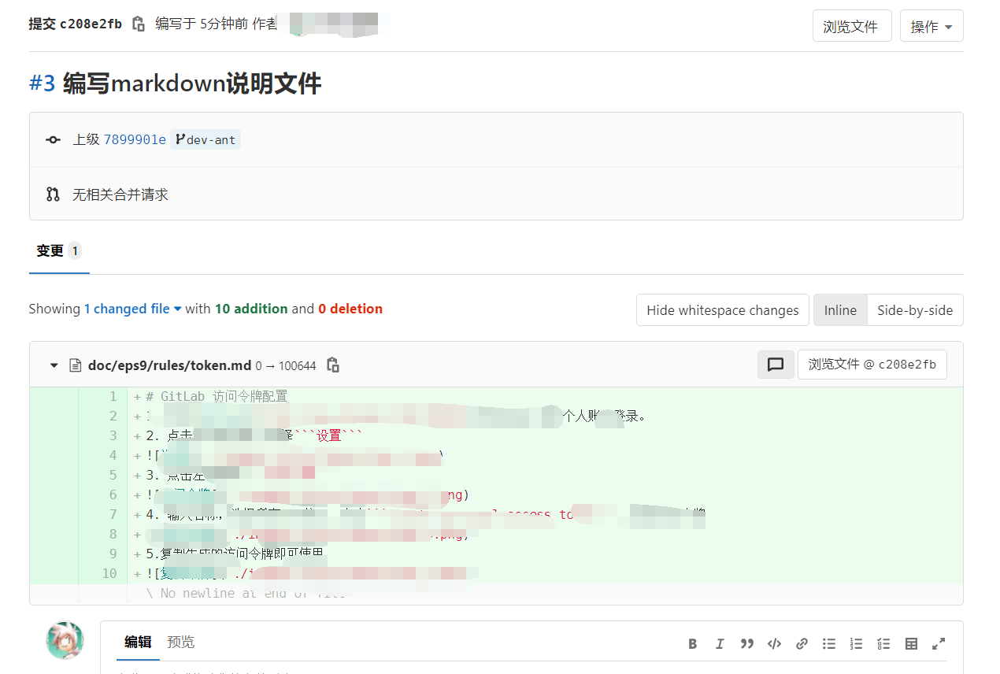