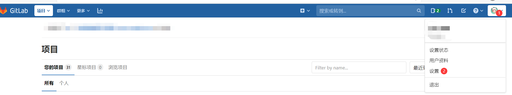
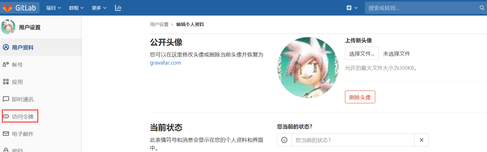
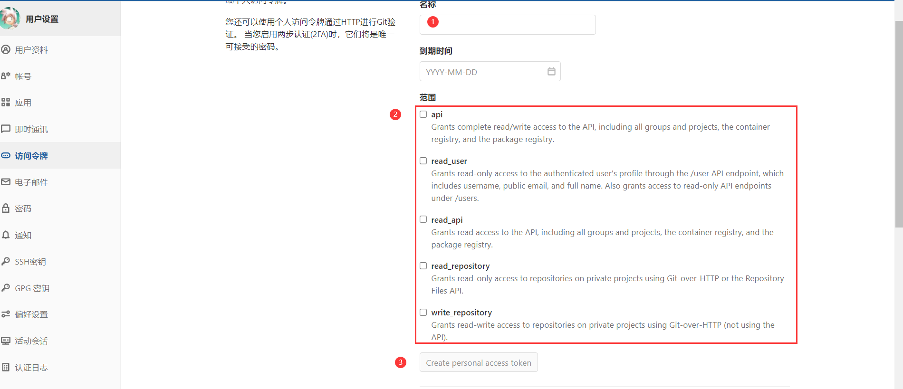
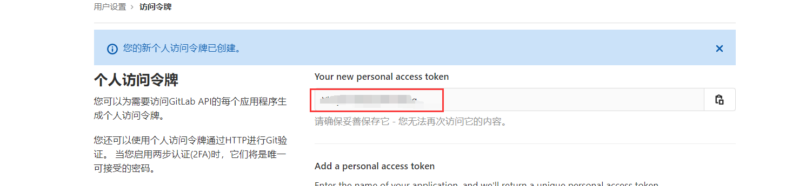

# GitLab 访问令牌配置
1. 访问[GitLab](http://www.dasaas.com:18890/)代码仓库，使用个人账号登录。
2. 点击右上角头像，选择```设置```

3. 点击左侧菜单```访问令牌```

4. 输入名称，选择所有API接口，点击```Create personal access token```，生成访问令牌

5.复制生成的访问令牌即可使用
